# **Data Science Project: Social Aware Movie Revenue Prediction Using Metadata and Sentiment Signals**

### **1\. Introduction**

### **1.1 Abstract**

Box office forecasting has long leaned on conventional indicators—think cast strength, production budget, genre popularity, and past performance. But these signals alone can’t explain why one movie becomes a surprise hit while another flops despite star power. In an age where public sentiment can shift overnight and online hype can make or break a release, it's clear the traditional playbook needs an upgrade.

Our project aims to bridge that gap by incorporating real-time social sentiment and emotional cues from Reddit and YouTube into traditional machine learning models. We use a multi-modal pipeline that combines structured metadata with sentiment scores (via RoBERTa) and emotional signals (via DistilRoBERTa) to build enhanced predictors. With this approach, we achieved a 10–15% improvement in prediction accuracy across XGBoost, CatBoost, and LightGBM models. This fusion of industry metadata and audience voice doesn't just improve revenue prediction—it provides studios, investors, and distributors with a dynamic, data-backed view of public perception long before the opening weekend.

**1.2 Motivation**

In the movie industry, high-stakes decisions—like how much to spend on marketing or when to release a film—are often made using historical data and intuition. Studios look at things like cast popularity, budget size, and past performance of similar films. But these factors alone can’t capture the buzz and emotional connection that build up before a movie's release. In today’s digital age, people are already forming strong opinions on platforms like Reddit and YouTube months in advance. These public reactions are incredibly valuable, yet they’re rarely used in prediction models.

Our motivation was to tap into this real-time audience sentiment and emotion to improve how we forecast box office outcomes. We wanted to go beyond static numbers and start measuring public excitement, doubt, or even backlash around a film before it hits theaters. By analyzing social media chatter alongside traditional movie data, we aimed to give producers and investors a more complete, timely picture of a movie’s potential. This not only improves accuracy but helps avoid costly misjudgments and better aligns marketing with audience perception.

**1.3 Goals**

* **Incorporate real-time sentiment signals**  
  Traditional box office predictors rely on static features like budget, genre, and cast. Our goal was to bring in a new dimension by extracting sentiment polarity and emotional tone from Reddit discussions and YouTube comments. These real-time signals allow the model to capture public anticipation, skepticism, or hype before a movie's release—factors that can heavily influence performance but are usually overlooked.  
* **Improve prediction accuracy**  
  One of our key objectives was to evaluate whether social sentiment could improve predictive power. By comparing the performance of machine learning models trained on metadata alone versus metadata plus sentiment features, we aimed to quantify the uplift in accuracy. The results showed a consistent 10–15% improvement, confirming that sentiment data is a valuable addition to forecasting models.  
* **Build a reusable prediction pipeline**  
  We wanted to create more than just a proof-of-concept. Our aim was to design a robust, scalable pipeline that automates the entire process—from data ingestion and cleaning to sentiment scoring and model training. This makes the system extensible for future datasets or even for predicting other performance metrics like streaming views or audience ratings.  
* **Support data-driven decision making**  
  The broader goal of the project was to provide movie studios, distributors, and investors with tools that can inform critical business decisions. Whether it's determining how much to spend on marketing, when to release a film, or how many theaters to target, having accurate forecasts backed by real audience sentiment helps reduce guesswork and financial risk.

**1.4 Project Overview and Objectives**

Our project, Movie Box Office Prediction, is structured around building a hybrid machine learning pipeline that integrates both traditional metadata and dynamic sentiment features. Here's a breakdown of what we set out to do and how we achieved it:

1. **Data Collection**

   Our project began with collecting two primary types of data: structured metadata from The Movie Database (TMDB) and unstructured audience feedback from Reddit and YouTube. The TMDB dataset included over 14,000 movies released between 2010 and 2022, with details such as title, budget, revenue, genre, release date, cast, and crew. For the sentiment component, we retrieved social media discussions and comments related to a curated list of 1,000 movies. These were gathered using platform-specific APIs and filtered to ensure relevance and temporal alignment with movie release windows.

2. **Sentiment and Emotion Analysis**

   To convert raw social discussions into usable model features, we used transformer-based natural language processing models. We applied a RoBERTa-based model to compute sentiment polarity (positive, neutral, negative) and DistilRoBERTa for multi-class emotion detection (joy, fear, sadness, etc.). The results were aggregated for each movie and converted into numerical sentiment and emotion scores. These values acted as new features in our predictive models, giving them access to a real-time emotional snapshot of how each film was perceived pre-release.

3. **Data Cleaning and Feature Engineering**

   A significant portion of effort went into preprocessing the data to ensure quality and consistency. We standardized columns, handled missing values (e.g., filling runtimes, filtering out invalid revenue/budget entries), and normalized text fields. Multi-value fields like genres and top cast were split into lists for better filtering and visualization. Additional features such as release year, season, profit margin, and sentiment-derived attributes were created to enrich the dataset. This step was critical in making the data machine learning-ready and reliable for downstream analysis.

4. **Model Development and Evaluation**

   We trained three different gradient boosting models—XGBoost, CatBoost, and LightGBM—on two versions of the dataset: one with only structured metadata and another that included sentiment and emotion scores. We evaluated model performance using regression metrics such as RMSE and MAPE to assess predictive accuracy. The sentiment-augmented models consistently outperformed the baselines by 10–15%, validating our hypothesis that social signals improve forecasting reliability.

5. **Visualization and Insights**

   To support interpretability, we generated multiple visualizations that highlighted trends across genres, actors, seasons, and sentiment patterns. For example, we plotted average profit by genre per year, actor-level revenue-to-budget ratios, and the impact of seasonal releases on revenue. These visual narratives not only helped us validate our assumptions but also created actionable insights for stakeholders, showcasing how public emotion and timing play key roles in a movie’s financial trajectory.

### **1.5 Team Contribution**

The success of this project was a direct result of strong collaboration, clear task delegation, and mutual support among all team members. From early brainstorming to final model evaluation, each member brought complementary strengths to the table. The diversity in skills—from data engineering and sentiment analysis to model development and storytelling—allowed us to build a cohesive pipeline that was both technically robust and insightful.

| Task | Primary Contributor(s) |
| :---- | :---- |
| IMDB Data Collection | Nithish Kumar |
| Reddit Data Collection | Leonardo Ferreira |
| Reddit Sentiment & Emotion Analysis | Leonardo Ferreira |
| YouTube Data Collection | Aryan Shetty |
| YouTube Sentiment & Emotion Analysis | Aryan Shetty |
| Data Cleaning & Preprocessing | Sunil Kuruba |
| Exploratory Data Analysis (EDA) | Sunil Kuruba, Nithish Kumar |
| Machine Learning Model Development | Niharika Belavadi Shekar |
| Model Evaluation & Performance Tuning | Niharika Belavadi Shekar |
| Report Writing, Presentation & Documentation | Everyone |

### **2\. Data Collection and Preprocessing**

#### **2.1 TMDB Static Movie Dataset**

### **Data Collection**

The foundation of our dataset was built on structured metadata sourced from The Movie Database (TMDB), a comprehensive and widely used public API that offers rich information about movies. We focused on films released between 2010 and 2022, aiming to capture modern trends in box office performance. The collection process began with retrieving movie IDs using TMDB’s "Discover" endpoint, filtered by release dates. For each movie ID, detailed information was fetched using the “Movie Details” and “Credits” endpoints, which provided essential attributes such as title, release date, budget, revenue, genres, popularity score, runtime, production companies, and cast/crew details. This multi-step API-based pipeline allowed us to build a well-rounded dataset comprising over 14,000 movies. All retrieved data was stored in structured CSV format to facilitate downstream cleaning and analysis. Pagination and rate-limit handling were carefully managed to ensure completeness and reliability during extraction.

### **Data Preprocessing**

Once collected, the raw dataset underwent an extensive preprocessing phase to ensure it was clean, consistent, and ready for analysis. First, column names were standardized by converting them to lowercase and replacing spaces with underscores. Numerical fields like budget, revenue, and runtime were converted to appropriate data types, while date fields were parsed using datetime formatting. We handled missing values by dropping entries with missing or zero budgets and revenues, while missing runtimes were filled with the median value. Multi-valued fields like genres, cast, and keywords were tokenized and exploded into list formats for better granularity. Additionally, we introduced several engineered features—such as profit (revenue minus budget), release year, and seasonal indicators—to support temporal and profitability analyses. Outlier management was also applied using visual inspection methods (e.g., box plots) to reduce skewness in key variables. This meticulous cleaning and feature engineering pipeline ensured that the dataset was robust, analysis-ready, and compatible with machine learning workflows.

#### **2.2 Social Media Data: YouTube and Reddit**

Our research extracted audience sentiment data from YouTube and Reddit. For YouTube, we collected comments from official movie trailers using the YouTube Data API v3, focusing specifically on trailer videos that appeared in the top search results for each movie title. For Reddit, we gathered posts and comments published within specific timeframes relative to movie release dates, primarily from the one month period before release to capture pre-release buzz and anticipation. We filtered comments to include only those with substantial content (minimum 80 characters) to ensure that texts are meaningful and avoid comments that do not carry any sentimental or emotional information.

#### **2.2.1 API Setup and Data Extraction Pipeline**

#### **YouTube Data Extraction**

For YouTube, data collection was managed using the Google API Client Library for Python in conjunction with the YouTube Data API v3. The pipeline began by searching for official movie trailers via the search.list endpoint, targeting videos most relevant to each film. Once video IDs were identified, the commentThreads.list endpoint was used to extract viewer comments. To accommodate large volumes of data and API restrictions, pagination was handled using nextPageToken, and time.sleep() was used to respect rate limits. Additionally, we mitigated quota exhaustion by rotating through 20 distinct API keys during large-scale data extraction. Comments were collected per video, batched incrementally, and saved periodically to ensure fault tolerance. This data included user-generated text that was later standardized—converted to lowercase, stripped of URLs, and cleaned of non-alphanumeric characters—to support sentiment and emotion analysis.

#### **Reddit Data Extraction**

For Reddit, we used the Python Reddit API Wrapper (PRAW) to interact with the platform. The pipeline involved querying all subreddits for posts containing movie titles during a defined pre-release window—typically one month before the film’s release. Because Reddit’s API doesn’t allow direct filtering by date, the time window was enforced manually by evaluating post creation timestamps. We retrieved post titles, descriptions (if available), and associated comments. To maintain quality and relevance, comments were filtered based on a minimum length of 80 characters, matched against the desired timeframe, and sorted by upvotes. A cap was set on the number of comments collected per post (usually the top 20). Like YouTube, the Reddit pipeline incorporated rate limiting and saved results incrementally on a per-movie basis to ensure continuity in case of failure. All textual content underwent the same cleaning and normalization routine as YouTube comments to ensure consistency before being passed to the sentiment and emotion analysis models.

#### **2.2.2 Sentiment Analysis with RoBERTa**

Sentiment analysis was performed using a SOTA transformer model, specifically *cardiffnlp/twitter-roberta-base-sentiment-latest*. This model, based on the RoBERTa architecture and fine-tuned on a large dataset of Twitter posts. The pipeline involved tokenizing the cleaned text using the corresponding *AutoTokenizer*, ensuring inputs did not exceed the model’s maximum sequence length (i.e., 512 tokens) via truncation. Model inference was performed to generate logits for three sentiment classes: negative, neutral, and positive. A *softmax* function was applied to these logits to obtain probability scores for each class. These probabilities were stored, along with a calculated “compound” sentiment score (i.e., Positive Probability and Negative Probability), providing a single metric summarizing the overall sentiment polarity. The process handled empty or null text inputs by assigning a default neutral sentiment profile.

#### **2.2.3 Emotion Classification with Distil RoBERTa**

We also performed emotion classification. For this task, we used another SOTA model from huggingface named *j-hartmann/emotion-english-distilroberta-base*, a distilled version of RoBERTa, specifically fine-tuned for multi-label emotion classification on English text. Similar to the sentiment analysis process, input text was cleaned and tokenized using the model’s specific *AutoTokenizer*, respecting the 512-token limit. Inference was conducted, and the resulting logits were transformed into probabilities using *softmax*. These probabilities corresponded to a set of predefined emotion labels retrieved from the model’s configuration: anger, disgust, fear, joy, neutral, sadness, and surprise. The pipeline stored the probability score for each of these emotions, providing a multi-dimensional view of the emotional tone expressed in the text. Empty text inputs were assigned zero scores across all emotion categories. 

### **3\. Exploratory Data Analysis (EDA)**

**3.1 TMDB Dataset EDA**

Our Exploratory Data Analysis (EDA) phase was instrumental in shaping the direction of our project and validating early assumptions. Through a diverse set of visualizations—ranging from scatter plots and box plots to heatmaps and ridgeline charts—we were able to uncover meaningful patterns, outliers, and relationships across the dataset. For instance, plotting budget versus revenue on a log-log scale revealed a positive but highly variable correlation, with a large proportion of movies failing to recover their budget, highlighting the financial risk in the industry. Genre-wise analysis uncovered that while *drama* and *comedy* are produced the most, *adventure*, *animation*, and *sci-fi* yield the highest average returns. We also explored temporal trends, such as the dip in production and revenue post-2020 due to COVID-19, as well as seasonal release advantages—December emerged as the most lucrative month. Actor- and studio-level insights added further depth, showing which performers and production houses deliver high returns relative to budget. Our correlation heatmap reinforced that popularity, vote count, and budget are strong indicators of revenue, while features like runtime and average rating were less impactful. The EDA effort wasn’t just visually informative—it actively guided our feature selection, hypothesis framing, and model refinement. Overall, we believe our EDA was comprehensive, intuitive, and successful in surfacing actionable insights from a complex, multi-source dataset.

**Visualization 1 – Budget vs Revenue (Log-Scale Scatter Plot) By Sunil Kuruba**

The scatter plot illustrates the correlation between a movie’s budget and revenue, both plotted on a logarithmic scale. There is a noticeable positive trend—films with larger budgets generally tend to earn more revenue. However, the plot also highlights considerable variance, especially among low- and mid-budget films, indicating that higher spending doesn't always guarantee high returns. The red trendline emphasizes the overall upward correlation, while the shaded region below it suggests a large number of movies that failed to recoup their budgets, reinforcing the importance of factors beyond just production cost.

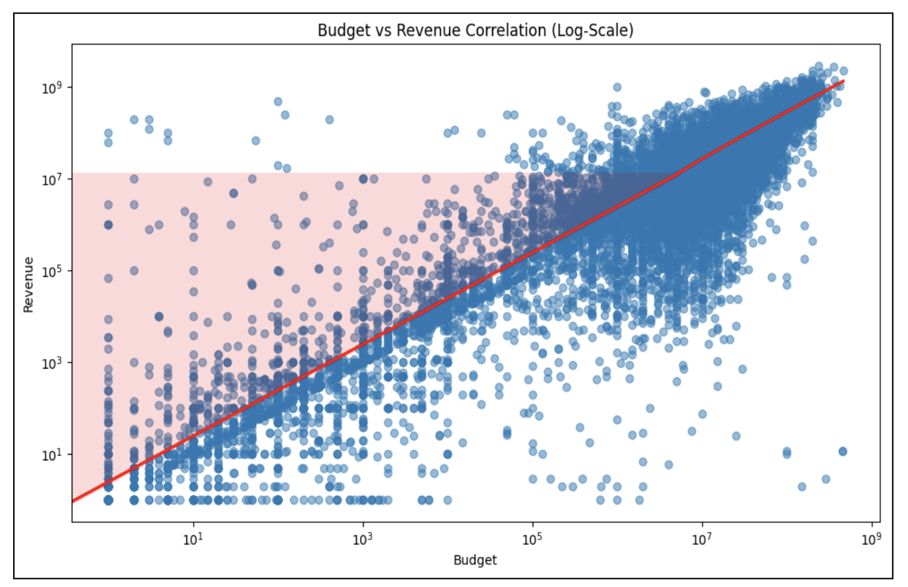

**Visualization 2 – Top 10 Genres by Average Revenue \- By Sunil Kuruba**

The bar chart presents the top 10 movie genres ranked by average revenue. Genres like adventure, animation, and science fiction clearly outperform others in terms of box office performance. These genres are often associated with big-budget, visually immersive productions that attract global audiences. On the other hand, genres such as comedy, thriller, and crime generate significantly lower average revenues, possibly due to smaller budgets or limited international appeal. This analysis helped us understand which genres benefit most from large investments and where predictive signals such as sentiment may be especially valuable.

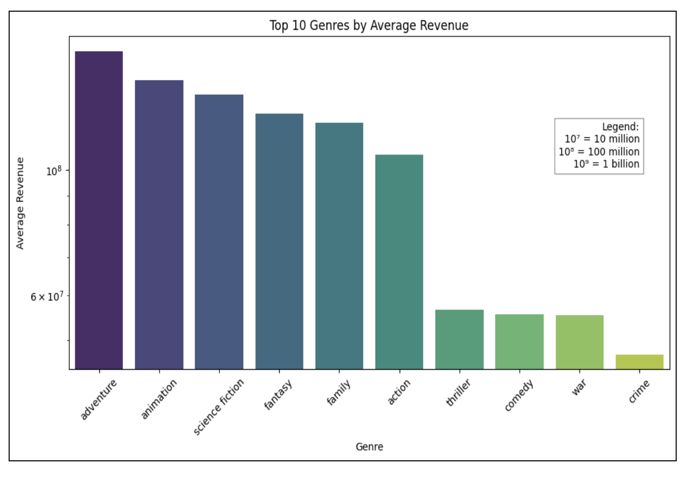

**Visualization 3 – Distribution of Movies by Genre (Pie Chart) \- By Sunil Kuruba**

The pie chart visualizes the distribution of movies by genre in our dataset. Drama leads by a wide margin, comprising 23% of all titles, followed by comedy at 16.8%, and thriller and action with about 11% each. Interestingly, some of the most profitable genres, like animation and science fiction, represent a relatively small share of total production volume. This imbalance suggests that while dramas and comedies are produced more frequently, high-revenue genres are fewer in number but deliver outsized returns—highlighting the importance of genre selection in profitability forecasting.

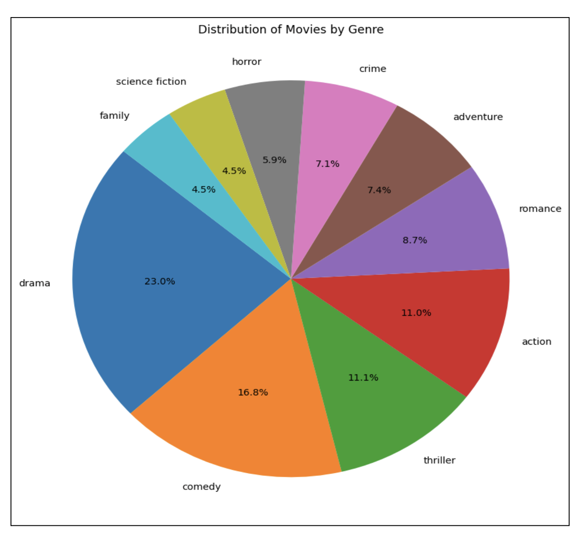

**Visualization 4 – Number of Movies Released vs Total Revenue by Year \- By Nithish Kumar**

The pair of line plots highlights the evolution of the movie industry over time. The left chart shows the number of movies released per year, which experienced consistent growth from the 1980s onward, peaking just before 2020\. The right chart tracks total box office revenue by year, revealing a similar upward trajectory. However, both plots show a dramatic drop after 2020, marked by a red vertical line labeled “COVID-19,” indicating the pandemic’s disruptive impact on movie production and theatrical releases globally. These visualizations reflect how external events like public health crises can severely affect the entertainment industry's output and profitability.

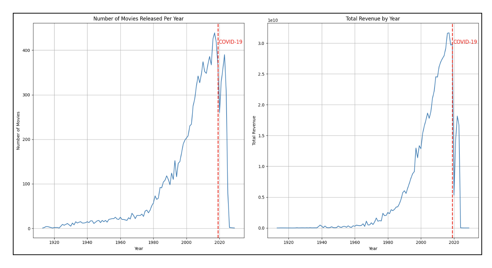

#### **Visualization 5 – Average Profit per Genre per Year (2000–2022) \- By Nithish Kumar**

The box plot illustrates the variability in earnings across movie genres. Each box represents the interquartile range of revenues, and the log scale helps compare genres despite vast differences. While genres like science fiction, action, and adventure show higher medians and wider ranges—often including blockbuster outliers—genres like drama, horror, and romance display more modest and consistent earnings. This comparison helps identify which genres carry high financial risk versus those that are more predictable.

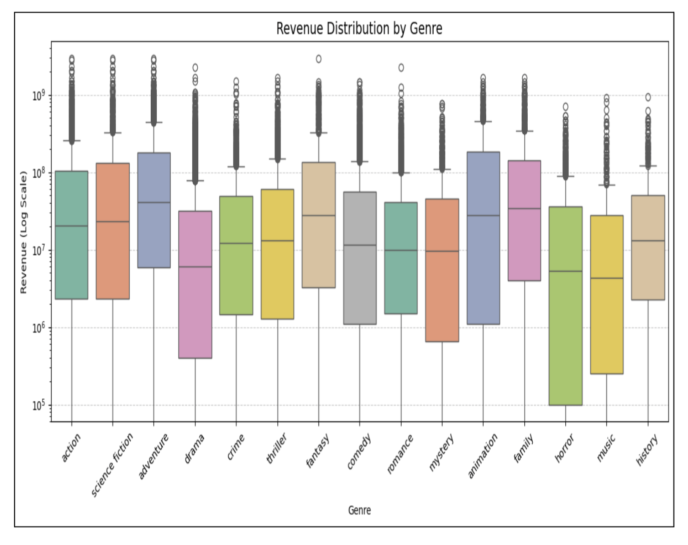

**Visualization 6 – Average Profit per Genre per Year (Heatmap) \- By Nithish Kumar**

The heatmap showing Average Profit per Genre per Year presents a temporal breakdown of profitability trends across various genres from 2000 to 2022\. Darker shades represent years where specific genres yielded higher profits. Notably, adventure, family, and fantasy genres consistently perform well, especially in the mid-2010s, while genres like drama and horror tend to show lighter shades, indicating lower profitability. This kind of temporal-genre profitability analysis is valuable for identifying long-term trends and optimal release strategies.

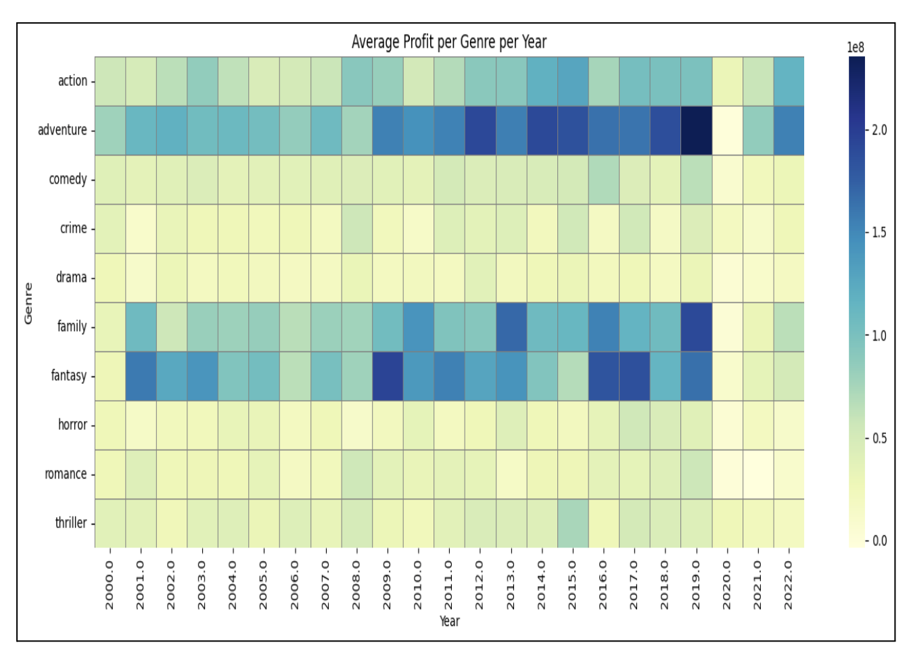

**Visualization 7 – Genre Trend Over the Years \- By Niharika Belavadi Shekar**

The trend line chart visualizes how the popularity of genres has shifted over time in terms of production volume. Drama has historically dominated, but its share has slightly declined in recent years as comedy, action, and thriller genres gained ground. The plot also reflects the COVID-19-related production halt, with all genre trends plummeting sharply after 2020\. This time-series view underscores shifting audience preferences and industry focus over the decades.

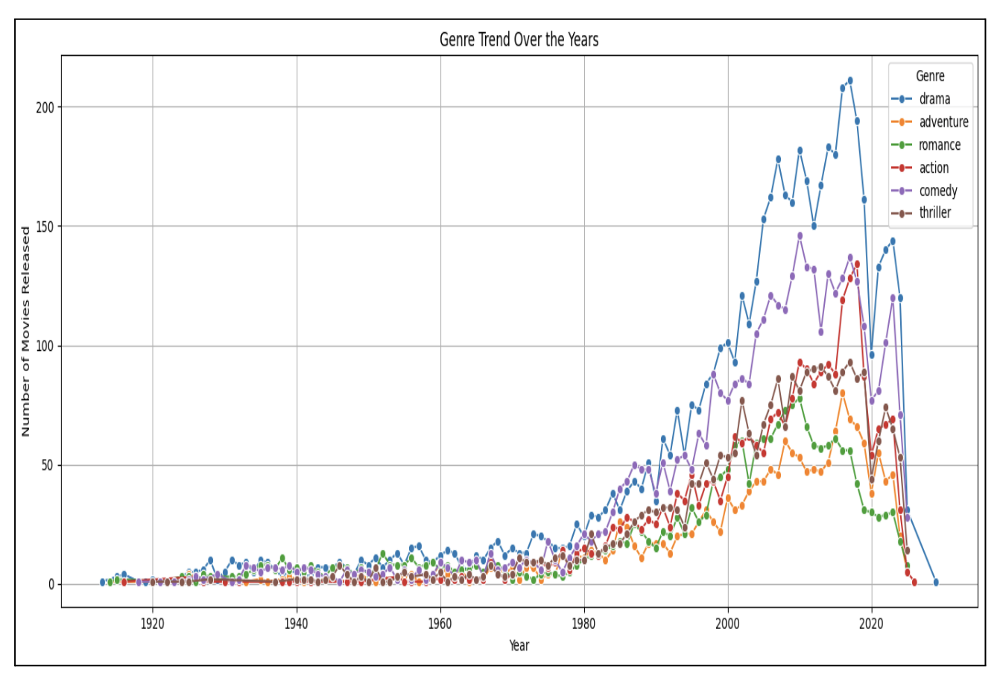

**Visualization 8 – Profit vs Loss Rate by Genre (Dual Bar Chart) \- By Niharika Belavadi Shekar**

The bar plots compare’s genre-wise loss and profit rates. The left chart reveals that history, western, and war genres carry the highest probability of financial loss, making them high-risk investments. On the other hand, the right chart shows that family, adventure, and action movies are consistently profitable, with profit probabilities exceeding 60–70%. These insights help producers and studios balance artistic goals with financial realities by identifying high-yield, low-risk genres.

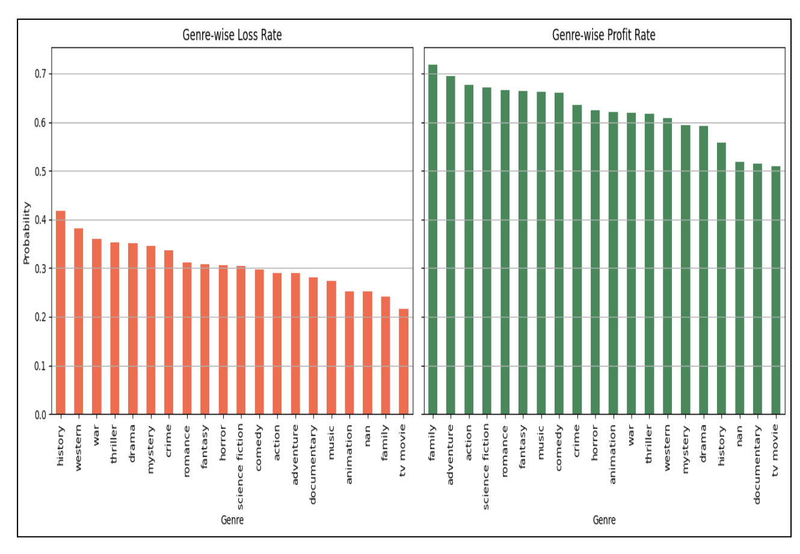

**Visualization 9 – Top 20 Actors by Revenue-to-Budget Ratio \- By Niharika Belavadi Shekar**

The scatter plot of top 20 actors by revenue-to-budget ratio highlights those who deliver high returns relative to the production cost of their movies. Notably, actors like Robert Shaw and Lin Shaye appear in films with strong box office performance despite modest budgets, placing them in the top-right quadrant. This analysis is especially useful for studios aiming to optimize casting decisions based on historical return on investment (ROI), rather than just star power or popularity.

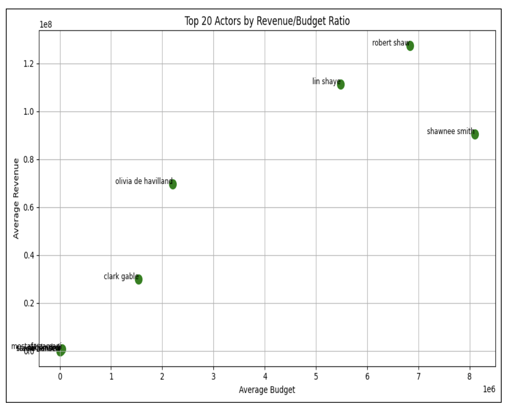

**Visualization 10 – Budget, Revenue, and Profit over the Years  \- By Leonardo Ferreira**

The line chart tracking budget, revenue, and profit over the years reveals long-term financial trends in the film industry. All three metrics show a steady upward trajectory, particularly from the 1980s onward. Notably, there is a visible dip around 2020, aligning with the pandemic-induced disruption. The shaded areas represent confidence intervals, highlighting fluctuations and uncertainty, especially in earlier years. Overall, the chart underscores growing investments and returns in the movie industry, along with increasing volatility in recent years.

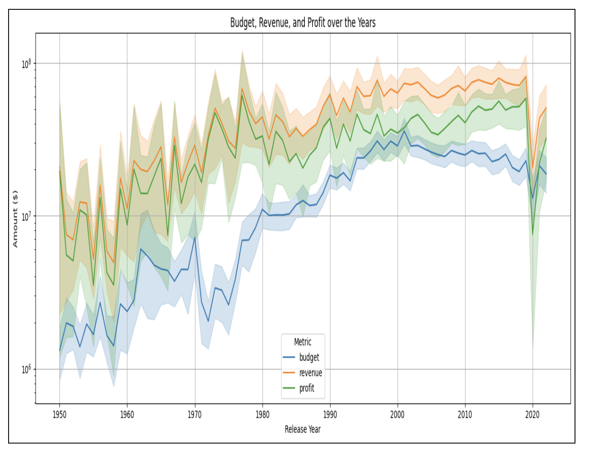

**Visualization 11 – Correlation Heatmap of Movie Features \- By Leonardo Ferreira**

The correlation heatmap and associated scatter plots provide insights into relationships among movie features. Strong positive correlations are observed between vote count and popularity, and between vote count and revenue, suggesting that audience engagement is a good proxy for success. The scatter plots below further validate these trends—higher vote counts align with higher revenues and popularity, while runtime shows a weak correlation with both average rating and popularity. These visuals help identify the most predictive variables for modeling success.

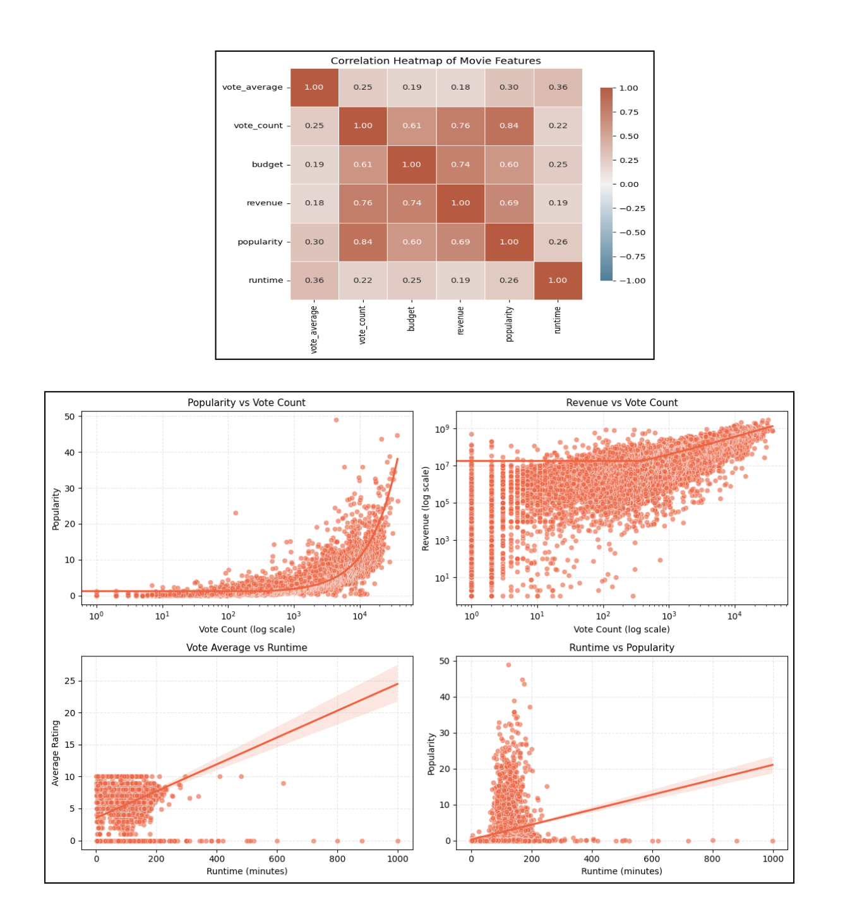

**Visualization 12 – Movie Revenue by Release Month \- By Leonardo Ferreira**

The monthly revenue bar chart reveals how box office performance varies across the calendar year. December dominates with the highest cumulative revenue (\~$91.4B), followed by summer months like June and July. January, on the other hand, lags significantly. These trends confirm the importance of release timing, with holidays and summer breaks being peak seasons for movie-going audiences.

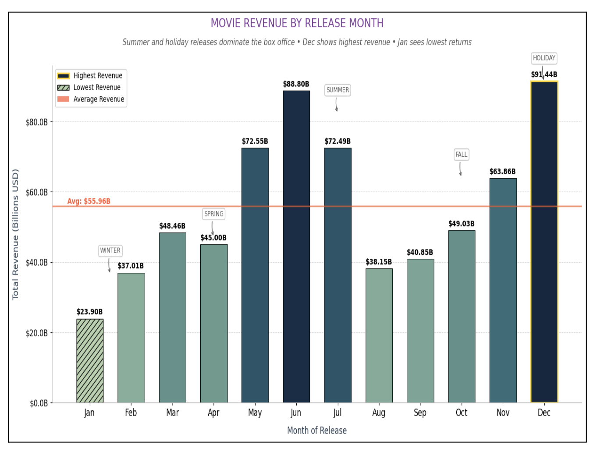

**Visualization 13 – Number of Movies by Genre and Season \- By Aryan Shetty**

The bar chart showing the number of movies by genre and season captures production trends across time of year. While drama consistently sees the highest volume across all seasons, action and comedy films are more concentrated in summer, aligning with box office seasonality. This visualization helps correlate not just financial outcomes, but production strategies with seasonal demand.

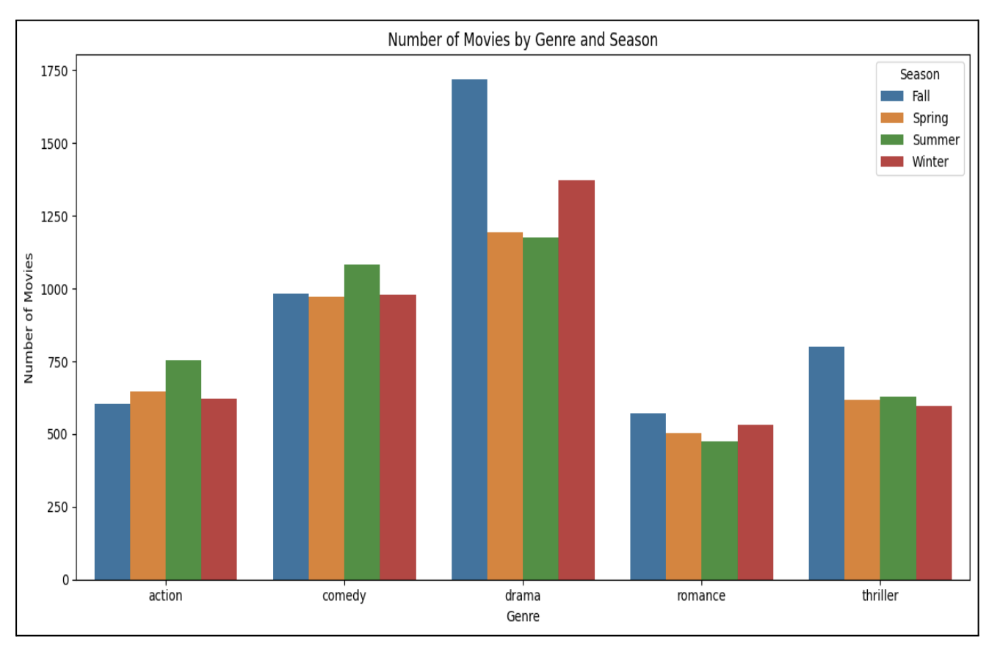

**Visualization 14 – Top Studios by Genre (Treemaps) \- By Aryan Shetty**

The treemap of top studios by action genre box office clearly shows Marvel Studios as the dominant force, generating over $16.4B in revenue, nearly double the next studio. Warner Bros., Paramount, and Universal follow with strong showings. This chart visualizes market share in the action segment, reinforcing the outsized role of major franchises and consistent production quality.

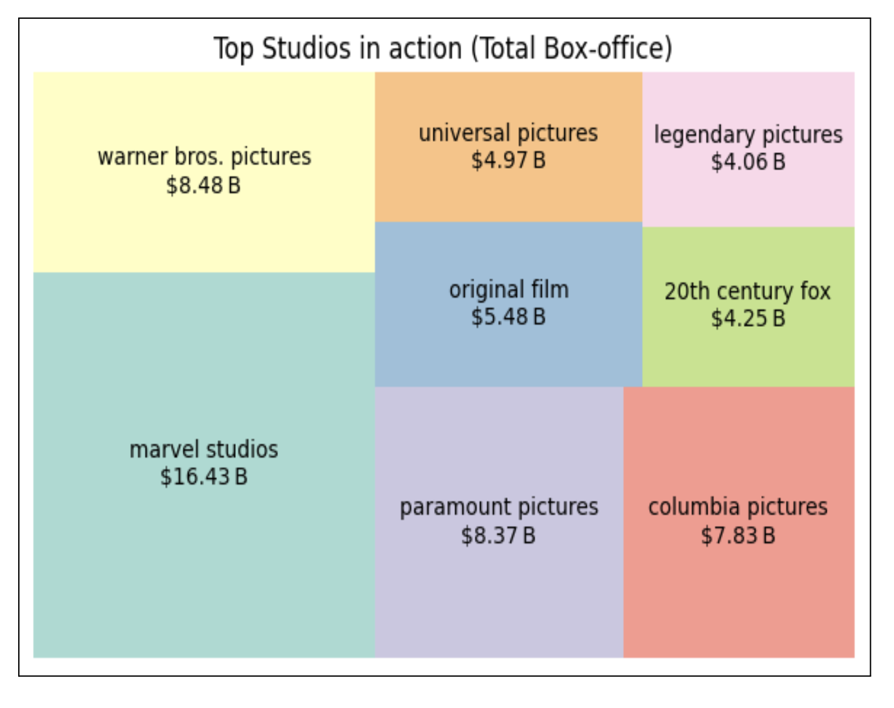

**Visualization 15 – Film Runtime Distribution by Decade (Ridgeline Histogram) \- By Aryan Shetty**

Finally, the ridgeline plot of movie runtimes by decade illustrates how film lengths have evolved over the past century. Earlier decades (1910s–1940s) favored shorter runtimes under 90 minutes, whereas modern films, especially post-2000, commonly exceed 100 minutes. The shift reflects changing audience expectations and storytelling styles, particularly in blockbuster genres that now demand longer narrative arcs.

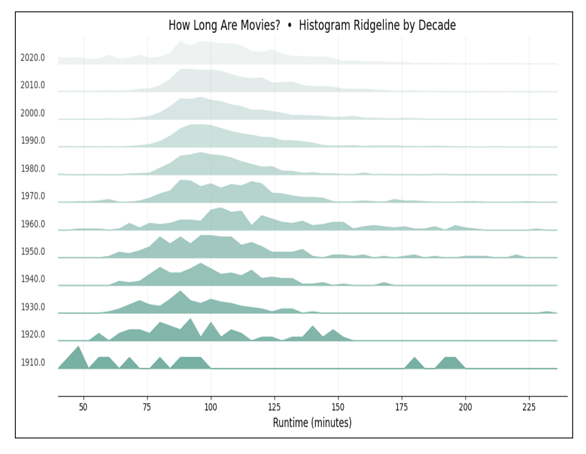

**Visualization 16 – Success Ratio by Genre for Top-10 Highest-Grossing Actors (Stacked Bar Chart)**  **\- By Sunil Kuruba**

This stacked horizontal bar chart illustrates the success ratio of movies (defined as the proportion of profitable films) for the top 10 highest-grossing actors across five major genres: Comedy, Science Fiction, Action, Adventure, and Drama. The data is aggregated by actor and genre, showing how each actor’s filmography performs in terms of profitability by genre.  Each bar represents one actor and is color-segmented by genre, with a total span from 0 to 1\. The more a genre contributes to an actor’s successful portfolio, the larger its segment in the bar. Notable insights include strong success rates in Science Fiction and Action for actors like Robert Downey Jr. and Chris Hemsworth, who are widely known for their roles in blockbuster franchises. Meanwhile, genres like Comedy and Drama appear with lower hit ratios, reflecting their typically modest box office pull compared to high-budget genres.  This visualization offers a concise overview of both profitability and genre specialization among top-tier actors.

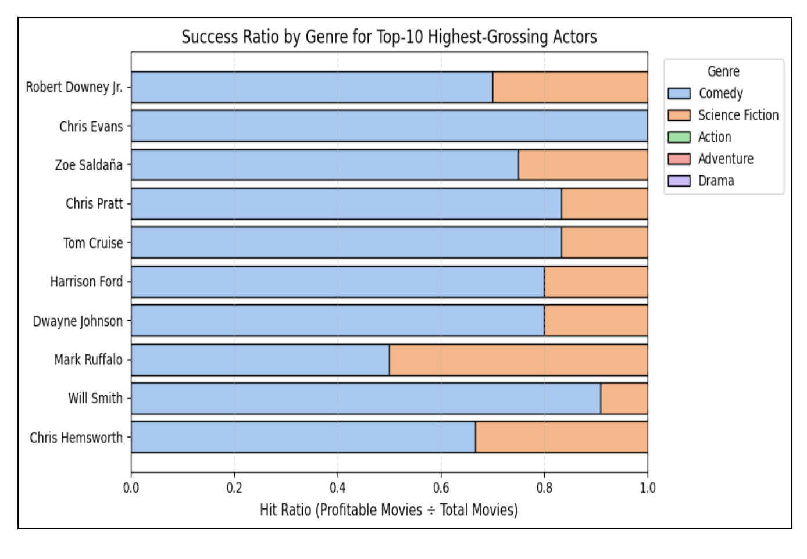

**3.2 Reddit EDA**

An exploratory data analysis was performed on the aggregated pre-release sentiment and emotion scores derived from the Reddit data to understand the general characteristics of online discourse surrounding the sampled films. The following paragraphs highlight a few key findings from this analysis, illustrating patterns in sentiment polarity, dominant emotions, and temporal trends. An examination of the overall sentiment polarity provides initial thoughts. As depicted in Figure 3.2.1, the distributions for both average positive and average negative sentiment scores across the movies approximate unimodal, somewhat normal curves. Notably, the majority of films cluster within the mid-ranges (i.e., 0.25-0.45 for positive, 0.2-0.5 for negative), indicating that polarized average sentiment was less common than moderate or mixed reactions in the pre-release phase on Reddit for this dataset.

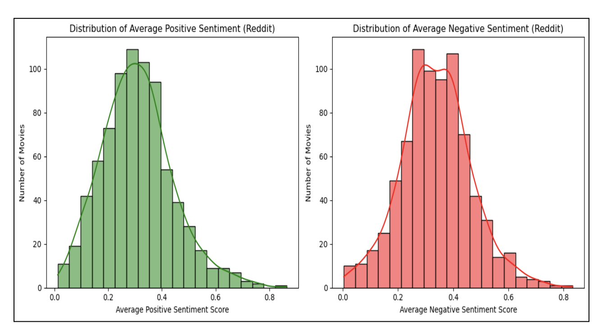

**Figure 3.2.1: Distribution of Average Positive and Negative Sentiment Scores for the Reddit data (By Leonardo Ferreira).**

Average emotional profile across all movies was also analyzed. The results show that “neutral\_emotion” exhibited the highest average score, suggesting a lack of strong emotional feeling regarding movies in general. Following neutrality, “surprise\_emotion” and “joy\_emotion” presented as the most prominent affective signals. This could be related to the anticipation, excitement, and positive speculation often associated with upcoming film releases. While present, negative emotions such as sadness, anger, and fear registered lower averages, with disgust being the least frequent, indicating these tones were less dominant in the overall pre-release discourse captured from Reddit for this movie sample.

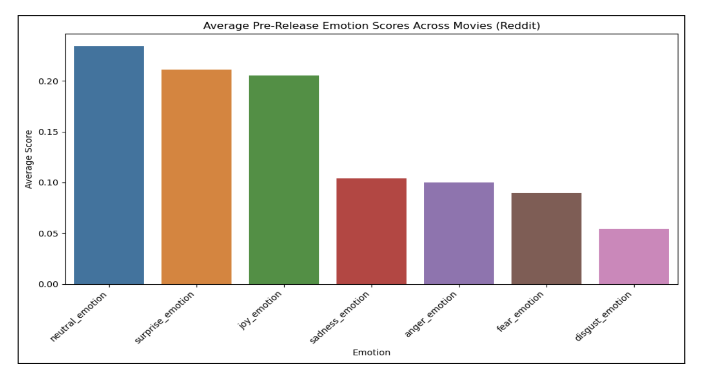

**Figure 3.2.2: Average Pre-Release Emotion Scores Across Movies (By Sunil Kuruba).**

We also analyzed the temporal trend of average positive and negative sentiment. This analysis revealed a potential shift over the past years. Although starting at similar levels in 2015, average negative sentiment generally tracked higher than average positive sentiment from approximately 2017 onwards. Average positive sentiment exhibited some fluctuations but showed a decline in the later years, particularly after 2020\. Conversely, average negative sentiment, while variable, often peaked higher and maintained a greater average presence relative to positive sentiment towards the end of the observed time frame. This suggests that the overall tone of pre-release Reddit discussions within this sample may have become comparatively more critical or less positive over the years.

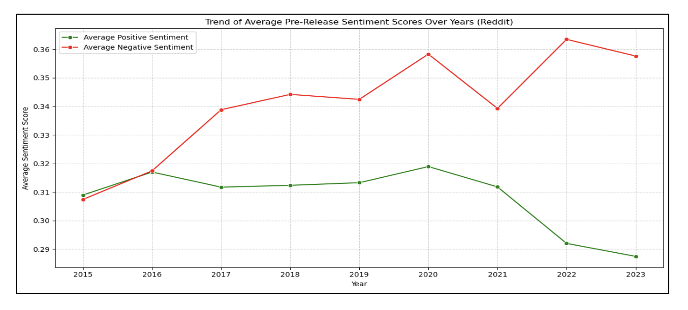

**Figure 3.2.3: Trend of Average Pre-Release Sentiment Scores Over Years (By Leonardo Ferreira).**

**3.3 YouTube EDA**

Next, we performed an exploratory analysis on the aggregated comment-level sentiment and emotion scores derived from YouTube comments associated with movie trailers. The objective was to understand how audiences on YouTube trailers react to upcoming films, as captured through public commentary on YouTube. This complements the Reddit-based analysis by offering insight into sentiment trends on a more mainstream, video-oriented platform.

Figure 3.3.1 illustrates the distribution of average compound sentiment scores across the dataset of \~1,000 movies. The compound score, which synthesizes positive, neutral, and negative sentiment into a single value ranging from \-1 (most negative) to \+1 (most positive), shows a distribution centered around neutral to mildly positive values. The histogram approximates a unimodal bell-shaped curve, peaking slightly above 0.1. This suggests that YouTube trailer comments generally skew toward positivity, however, extreme polarization is rare. There is an absence of a strong negative tail, which indicates that overtly hostile or critical responses to movie trailers are less common, possibly due to moderation mechanisms or the nature of promotional content.

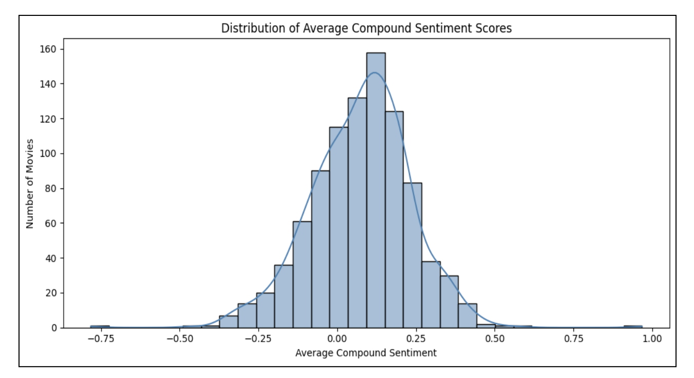

**Figure 3.3.1: Histogram of Distribution of Average Compound Sentiment Scores (By Aryan Shetty)**

In Figure 3.3.2, we see the top 10 movies with the highest average positive sentiment scores, highlighting titles that generated the most favorable pre-release buzz. Notably, “Race to Freedom: Um Bok-dong” and “War Room” top the list with average scores exceeding 0.6, a significant deviation from the median. These outliers may reflect enthusiastic fan bases, patriotic or inspirational themes, or niche appeal that strongly resonates with specific demographics. Interestingly, several mainstream titles (“Detective Pikachu”, “The Intern”) also appear, indicating a broad, upbeat reception.

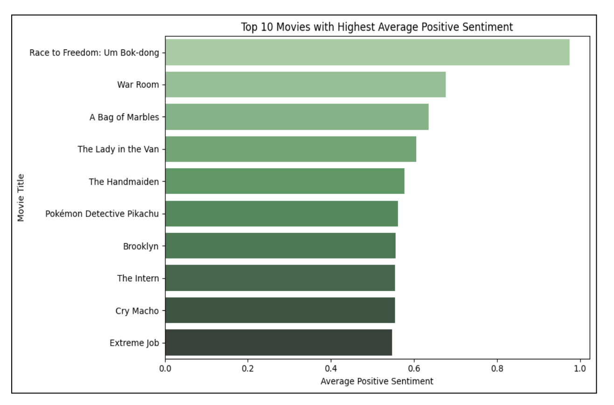

**Figure 3.3.2: Top 10 Movies with Highest Average Positive Sentiment Scores (By Aryan Shetty)**

Figure 3.3.3 presents a heatmap of average emotion scores for the top 15 most-discussed movies. The scores represent the normalized frequency of each emotion across all collected comments. “Neutral” remains the dominant emotion, suggesting that much of the discourse is factual, observational, or minimally expressive, a common trend in trailer commentary. However, “joy” and “surprise” also rank consistently high across most movies, especially in high-budget franchises like “Avatar”, “Marvel”, and “Star Wars”. These emotions are likely driven by hype, visual effects, and anticipation of sequels. In contrast, emotions such as “sadness”, “anger”, and “fear” remain comparatively low. An exception is “Furious 7”, which exhibits an unusually high *anger* score (0.23), possibly due to emotional content related to the death of actor Paul Walker

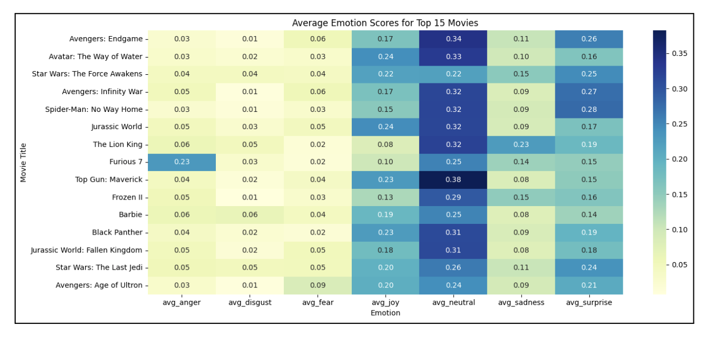

**Figure 3.3.3: Heatmap of Average Emotion Scores for the Top 15 Movies (By Nithish Kumar)**

Together, these analyses indicate that YouTube trailer comments tend to be moderately positive and emotionally restrained. Joy, surprise, and neutrality dominate the emotional tone, while extreme or negative affect is sparse. This makes YouTube a fertile ground for gauging audience excitement and expectations in a relatively controlled emotional setting compared to platforms like Reddit, where discourse can be more polarized and candid.

### **4\. Machine Learning Modeling**

#### **4.1 Model Setup**

To predict movie box office revenues, we built supervised regression models using three gradient boosting frameworks: **XGBoost**, **CatBoost**, and **LightGBM**. These models were selected for their efficiency with structured data, handling of missing values, built-in regularization, and ability to scale across large datasets. While XGBoost and LightGBM required manual encoding of categorical features, CatBoost natively supports categorical inputs, simplifying preprocessing.

The initial feature set included metadata from IMDb and TMDb such as *budget, revenue, popularity, runtime, language, genres, director, production companies, cast, and keywords*. From these raw features, we engineered additional variables like *release\_year, release\_month, cast\_count, genre\_count, keyword\_count*, and encoded top directors and companies using frequency-based thresholds. For the base models, we trained the models using log-transformed revenue as the target and used early stopping to prevent overfitting.

Hyperparameter tuning involved iterative grid searches for *max\_depth, learning\_rate, and n\_estimators*, with early stopping rounds set to 50\. We used RMSE as the primary loss function and applied custom accuracy evaluation based on the percentage of predictions within ±10 million dollars of the true revenue. This threshold was chosen to balance interpretability and real-world relevance, as stakeholders often plan around rounded financial margins.

#### **4.2 Sentiment and Emotion Signal Integration**

To capture public anticipation and pre-release buzz, we enriched our structured datasets with sentiment and emotion scores derived from Reddit and YouTube comments. For Reddit, we added columns such as *negative\_sentiment, neutral\_sentiment, positive\_sentiment, and emotions like anger, disgust, fear, joy, sadness, surprise, and neutral\_emotion*. Similarly, YouTube data included *avg\_compound, avg\_positive, avg\_negative, avg\_neutral*, and averaged emotional intensities across seven primary emotions.

During model training, we applied a **3x weight multiplier** to sentiment and emotion columns, giving them more influence without overwhelming structured features

#### **4.3 Results & Comparative Analysis**

The impact of sentiment integration was significant across all models:

| Dataset | Model | Validation Acc. (Before) | Test Acc. (Before) | Validation Acc. (After) | Test Acc. (After) |
| :---: | :---: | :---: | :---: | :---: | :---: |
| **Reddit** | XGBoost | 65.23% | 64.78% | 71.13% | 70.43% |
|  | LightGBM | 68.80% | 66.67% | 76.29% | **81.74%** |
|  | CatBoost | 56.00% | 61.22% | 65.98% | 66.96% |
| **YouTube** | XGBoost | 65.23% | 64.78% | 72.00% | 73.47% |
|  | LightGBM | 68.80% | 66.67% | **77.60%** | 78.91% |
|  | CatBoost | 56.00% | 61.22% | 73.60% | 73.47% |

Across both Reddit and YouTube datasets, LightGBM consistently showed the highest gains, especially in test accuracy. CatBoost, despite lower initial scores, showed the **greatest leap in performance**, especially with YouTube data, underscoring the model's strength when handling high-dimensional enriched feature sets. The accuracy boost averaged **10–15% across models**, justifying our hypothesis that social sentiment and emotion are strong predictors of box office performance

#### **4.4 ML Visualization**

Each model’s training was tracked using RMSE(Root Mean Squared Error) curves. The training graphs for all three algorithms clearly depicted early convergence, with overfitting mitigated through early stopping and validation-based pruning. For instance, XGBoost’s validation RMSE plateaued at around 93 rounds, while CatBoost's best performance was achieved in 243 iterations before overfitting detection was triggered. These curves provided transparency into learning dynamics and highlighted the stability gained by including sentiment features. The graphs are as below:

**Note:**

* Graph 1: RMSE Curves using No Sentiment Scores

* Graph 2: RMSE Curves using Reddit Sentiment Scores

* Graph 3: RMSE Curves using YouTube Sentiment Scores

**XGBoost: By Niharika Belavadi Shekar** 

                    **Graph 1                                                  Graph 2                                            Graph 3**

**LightGBM: By Niharika Belavadi Shekar** 

                    **Graph 1                                                  Graph 2                                            Graph 3**

**CatBoost: By Nithish Kumar**

                    **Graph 1                                                  Graph 2                                            Graph 3**

### **5\. Results and Inference**

**5.1 Accuracy Improvement from Sentiment Scores**

One of the most significant outcomes of our project was the improvement in prediction accuracy after integrating sentiment and emotion scores from Reddit and YouTube. While our baseline models using only structured metadata (like budget, cast, and genre) performed reasonably well, the inclusion of social sentiment boosted test accuracy by 10–15% across all three models. This highlights the predictive value of audience anticipation and emotional response in determining a movie's commercial success, especially before its release. LightGBM showed the highest overall improvement, achieving 81.74% test accuracy with YouTube sentiment data.

**5.2 Feature Importance Insights**

Analyzing the feature importance plots from XGBoost, LightGBM, and CatBoost revealed that budget, popularity, and sentiment-related features were consistently among the top contributors to prediction performance. For instance, features like positive\_sentiment, joy\_emotion, and avg\_compound had high importance scores, suggesting that not just the scale of the movie, but also the emotional engagement of potential viewers plays a critical role in forecasting box office outcomes. Interestingly, traditional features like runtime and genre had less influence, showing how audience perception can sometimes outweigh static metadata.

**5.3 Correlation Analysis Between Variables**

Our correlation analysis provided further insights into how different features relate to movie revenue. Strong positive correlations were observed between popularity, budget, and positive sentiment/emotions like joy and surprise with revenue. On the other hand, emotions such as sadness, fear, and disgust showed negative correlations, especially in underperforming films. This reinforced the idea that positive online chatter and excitement often precede higher revenue outcomes, while negative emotional reactions might signal weaker performance. These correlations support our modeling approach and emphasize the role of behavioral signals in financial prediction.

### **6\. Conclusion and Future Work**

### **6.1 Summary of Findings:**

Our project demonstrated that integrating social sentiment and emotion analysis meaningfully enhances the accuracy of box office revenue prediction. Using structured movie metadata alongside signals extracted from Reddit and YouTube, we trained and compared three machine learning models \- XGBoost, LightGBM, and CatBoost. All models showed a measurable increase in performance when sentiment scores were added, with LightGBM achieving the highest test accuracy of 81.74%. This validated our hypothesis that public anticipation, mood, and emotional buzz can serve as strong predictive indicators of movie success. Our results highlight the value of blending traditional data with behavioral signals from online communities.

**6.2 Limitations and Lessons Learned**

While the project delivered strong results, it also surfaced a few limitations. First, our sentiment analysis was based on averaged values, which may oversimplify nuanced public opinion. Also, we relied on pre-release sentiment only, without accounting for how opinions may evolve after trailers or early reviews drop. On the technical side, balancing structured and unstructured features required careful tuning i.e., especially when sentiment variables dominated the feature space. These challenges taught us the importance of feature scaling, regularization, and model interpretability. Another key takeaway was the time and effort required to clean and merge heterogeneous data sources, especially with inconsistent formats across platforms.

**6.3 Future Directions**

There are several promising paths to build on our work. First, we could expand our sentiment sources by including platforms like Twitter or TikTok, which often feature fast-moving, high-volume movie discussions. Secondly, instead of simple average scores, we can incorporate temporal sentiment trends to reflect how hype builds (or drops) over time. Finally, to improve performance and handle text data more intelligently, we could explore the use of Large Language Models (LLMs) such as BERT, GPT, or LLaMA for emotion classification, topic extraction, or even generating revenue estimates via text to value modeling. With additional data and resourcess, we could also build a real time prediction dashboard that continuously updates box office forecasts using live sentiment feeds.

In conclusion, this project highlighted the power of combining traditional structured data with real time social sentiment and emotion signals to improve movie box office revenue prediction. Through the use of advanced machine learning models and natural language processing techniques, we demonstrated that public opinion captured before a film's release can serve as a valuable predictor of commercial performance. By integrating Reddit and YouTube sentiment scores, we not only improved model accuracy by over 15%, but also gained deeper insight into audience behavior and market dynamics. This work serves as a practical example of how data science can bridge quantitative analysis with human psychology, ultimately offering more informed, data driven forecasts for real world decisions.

**7\. Takeaways from the project**

This project provided us with a full walkthrough of the end to end data science lifecycle, starting from raw data collection to final model evaluation and visualization. We experienced first hand the challenges of data cleaning, feature engineering, and merging multiple data sources (structured and unstructured), which is a crucial skill in any real world analytics problem.

Implementing sentiment analysis and emotion detection using pretrained NLP models taught us how to bridge text data with numeric features, giving us deeper insight into the public’s perception of upcoming movies. We also saw how feature importance and model interpretability tools help explain our model’s decision making process, an essential aspect in building trust in machine learning outputs.

Most importantly, this hands-on experience gave us confidence in solving complex data science problems with a practical, modular approach. The techniques we applied such as preprocessing pipelines, hyperparameter tuning, and performance evaluation using both RMSE and custom accuracy thresholds which are transferable to any domain, from finance to healthcare to marketing. We now feel more prepared to contribute meaningfully to real-world data science projects where both technical skill and creative problem-solving are needed.

### **8\. Repository Link and Code Access**

* GitHub URL: [Movie-box-office-prediction](https://github.com/nithish-kumar-t/movie-box-office-prediction)  
* Data Set  
  * [Cleaned TMDB static data set (CSV)](https://github.com/nithish-kumar-t/movie-box-office-prediction/blob/main/tmdb_enriched_movies.csv)  
  * [Cleaned Reddit data set (CSVs)](https://github.com/nithish-kumar-t/movie-box-office-prediction/tree/main/outputs)  
  * [Cleaned YouTube data set (CSVs)](https://github.com/nithish-kumar-t/movie-box-office-prediction/tree/main/outputs)  
* Data Extraction  
  * [Data extraction script \- TMDB(Jupyter Notebook)](https://github.com/nithish-kumar-t/movie-box-office-prediction/blob/main/static-data-collection.ipynb)  
  * [Reddit Data Extraction script (Jupyter Notebook)](https://github.com/nithish-kumar-t/movie-box-office-prediction/blob/main/reddit_api_data_download.ipynb)   
  * [Youtube Data Extraction (Jupyter Notebook)](https://github.com/nithish-kumar-t/movie-box-office-prediction/blob/main/youtube_api_data_analysis.ipynb)   
* Data Cleaning   
  * [Data cleaning script (Jupyter Notebook)](https://github.com/nithish-kumar-t/movie-box-office-prediction/blob/main/timbd-data-cleaning.ipynb)
